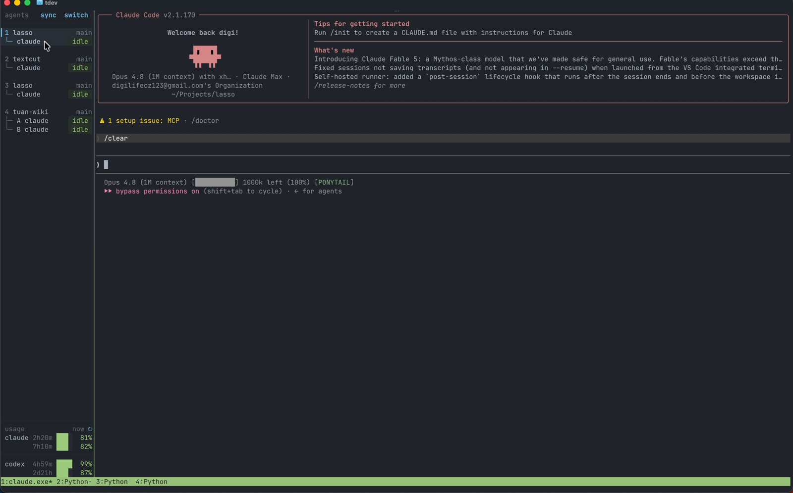

# tmux-lasso

A tiny tmux sidebar that shows every AI agent (Claude Code, Codex, ...) and its status at a glance — and pings you when one is done, so you stop babysitting tabs.

[](https://youtu.be/VfRINxgMcHQ)

**[Read the full story on the blog →](https://tuanphung.dev/writing/tmux-lasso/)**

## What it does

- **Always-on sidebar** — lists every agent grouped by repo, with a status pill (idle / working / done)
- **Auto-detection** — new Claude Code or Codex agents appear in the list on their own, no setup per agent
- **Sound alerts** — plays a sound when an agent finishes or needs your input
- **Usage tracking** — shows Claude Code and Codex daily usage at the bottom
- **Phone-friendly** — collapses on narrow screens; drive everything from SSH on your phone
- **No new keybindings** — uses your existing tmux shortcuts, toggle with `prefix + g`



No hooks, no `settings.json` edits — tmux-lasso reads session state by scraping the panes, so install is just the plugin line below.

Inspired by [herdr](https://herdr.dev/) — I loved the "see every agent at once" idea and built a small version on top of tmux.

## Requirements

- tmux
- python3 (stdlib only — nothing to `pip install`)

## Install

### With [TPM](https://github.com/tmux-plugins/tpm) (recommended)

Add to `~/.tmux.conf`, then hit `prefix + I` to fetch:

```tmux
set -g @plugin 'tuanphungcz/tmux-lasso'
```

### Manual

```sh
git clone https://github.com/tuanphungcz/tmux-lasso ~/.tmux/plugins/tmux-lasso
```

Add to `~/.tmux.conf` and reload (`prefix + r` or `tmux source ~/.tmux.conf`):

```tmux
run-shell ~/.tmux/plugins/tmux-lasso/tmux-lasso.tmux
```

## Config

```tmux
set -g @tmux_lasso_key g            # toggle key (prefix + g)
set -g @tmux_lasso_new_window_key c # new tab key (prefix + c); set to off to keep tmux default
set -g @tmux_lasso_width 18         # sidebar columns (also TMUX_LASSO_WIDTH / TMUX_LASSO_MIN_WIDTH env)
set -g @tmux_lasso_mobile_width 90  # below this client width: hide sidebar (tap top bar to switch) (also TMUX_LASSO_MOBILE_WIDTH env)
```

## Sound on finish (optional)

Play a short sound when an agent changes state:

- **done** — agent finished (`working → done`) → `@tmux_lasso_sound`
- **needs input** — agent is blocked waiting on you → `@tmux_lasso_sound_request`

```tmux
set -g @tmux_lasso_announce on
set -g @tmux_lasso_sound         ~/.config/tmux-lasso/done.mp3
set -g @tmux_lasso_sound_request ~/.config/tmux-lasso/request.mp3
```

Unset sounds fall back to `/System/Library/Sounds/Glass.aiff`. Toggle live with
`tmux set -g @tmux_lasso_announce on|off`.

## Tests

```sh
python3 -m py_compile *.py && sh -n toggle.sh tmux-lasso.tmux
python3 -m unittest discover -p 'test_*.py'
```

## License

[MIT](LICENSE)
